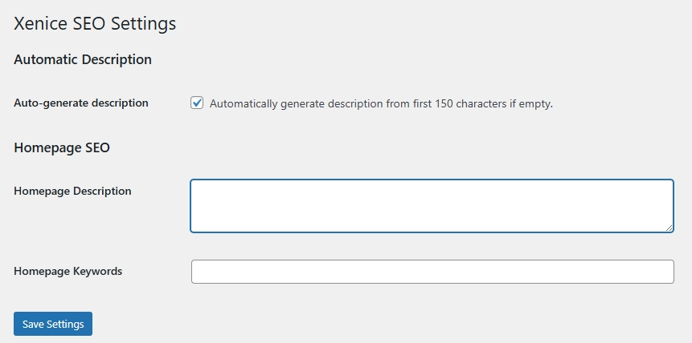
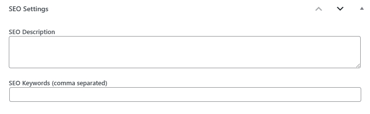
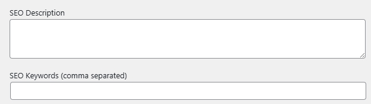

# Xenice SEO — Lightweight WordPress SEO

A lightweight alternative to heavy SEO plugins like Yoast or Rank Math.  
Xenice SEO provides essential meta description and keyword control — simple, fast, and effective.

## Plugin Homepage

https://www.xenice.com/plugins/xenice-seo

## Screenshots

### 1. Global settings page

### 2. SEO fields under the post editor

### 3. SEO fields for categories or tags

## Installation

1. Download and unzip the plugin.
2. Upload the folder `xenice-seo` to `/wp-content/plugins/`.
3. Activate the plugin from the **Plugins** page in your WordPress dashboard.
4. Go to **Settings → Xenice SEO** to configure.

## Frequently Asked Questions

### Does it support custom post types?
Yes. Xenice SEO automatically adds SEO fields to all public post types.

### Does it conflict with Yoast or Rank Math?
No. Xenice SEO only manages `<meta name="description">` and `<meta name="keywords">` and does not override the `<title>` tag.

### Can I auto-generate descriptions?
Yes. If enabled, Xenice SEO will automatically generate a description from the first 150 characters of post content when none is provided.

### Is it translation-ready?
Yes, it supports standard WordPress translation functions (`__()` and `_e()`).

## License

This plugin is free software; you can redistribute it and/or modify it under the terms of the GNU General Public License version 2 or later.

